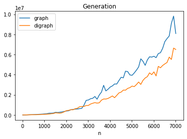
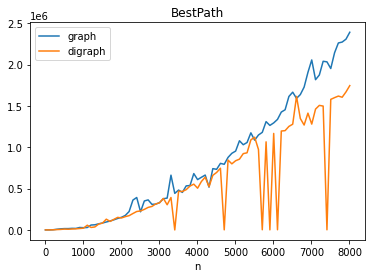
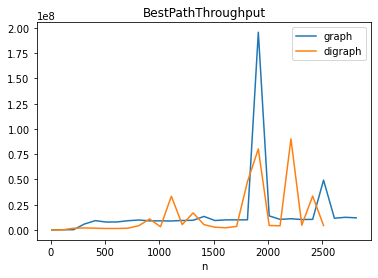
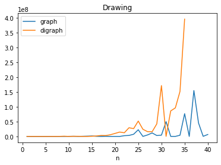
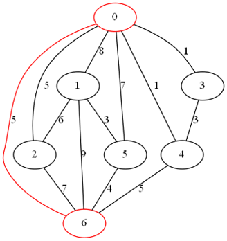
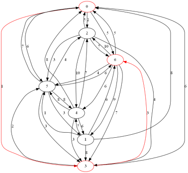
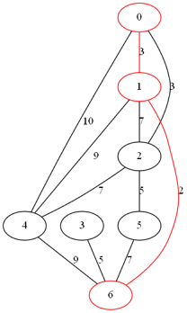
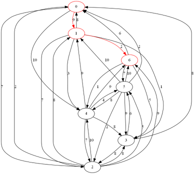

# lab3
Лабораторная работа №3

*По курсу «Языки программирования и методы программирования» (информатика, 3 семестр)*

Работу выполнила Суслова Ирина, группа Б20-215

***Цель***: написать программу на C++, реализующую алгоритмы (поиска) на графах.

В данной работе было ***реализовано***:

1. Структура графа (6 баллов) и орграфа (5 баллов)
1. Алгоритм поиск кратчайших путей (алгоритм Дейкстры) (5 баллов)
1. Проанализирована его работа на большом графе (8 баллов)
1. Алгоритм поиска пути с наибольшей пропускной способностью (7 баллов)
1. Генерация графа по заданный параметрам (10 баллов)
1. Материализация графа (3 балла)
1. Был использован алгоритм динамического программирования (10 баллов)

Сумма – 54 балла.

При ***генерации*** можно указать следующие параметры: вид графа (ориентированный/неориентированный), количество вершин, количество ребёр (необязательно, может быть произвольным).

Код тестов можно посмотреть в «tests.cpp», результаты измерения времени и графики в папке «testsLab3». Графики были построены с помощью библиотеки pandas для Python. Посмотреть реализацию можно в «lab3.ipynb» (файл jupyter notebook).

Меню представлено в виде сайта, папка сервера – «localhost». Код, который запускается при запросе на сервер, находится в «main.cpp»

***Графики***

|||
| :- | :- |
|||

***Пример работы алгоритмов:***

***BestPath (граф и орграф):***

|||

***BestPathThroughput (граф и орграф):***

|||

